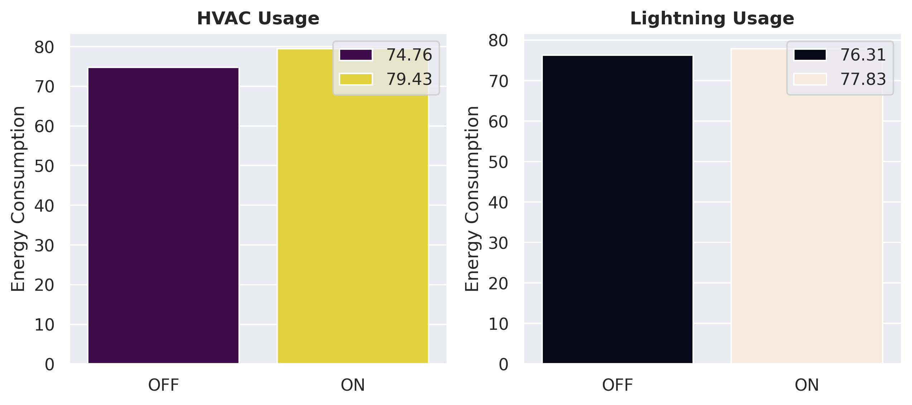
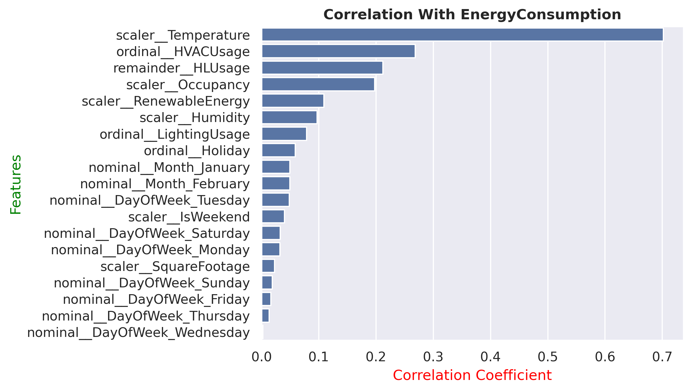
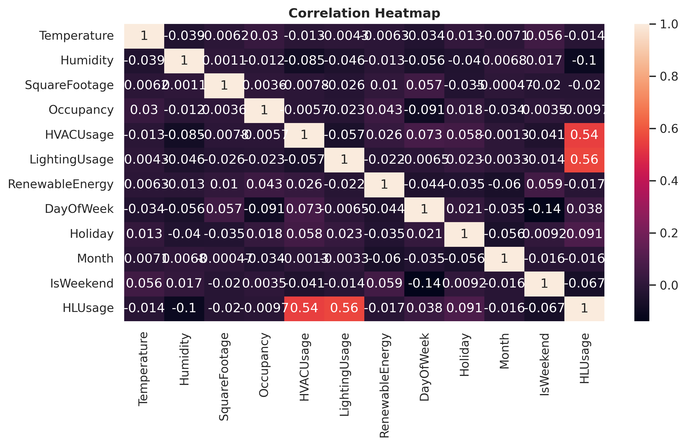
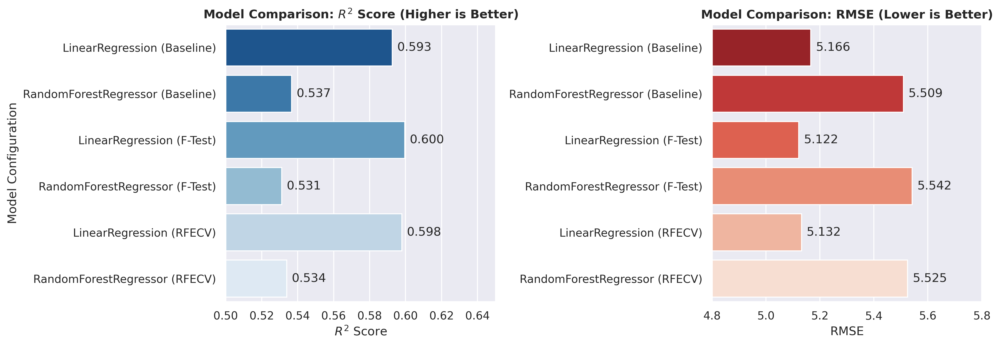
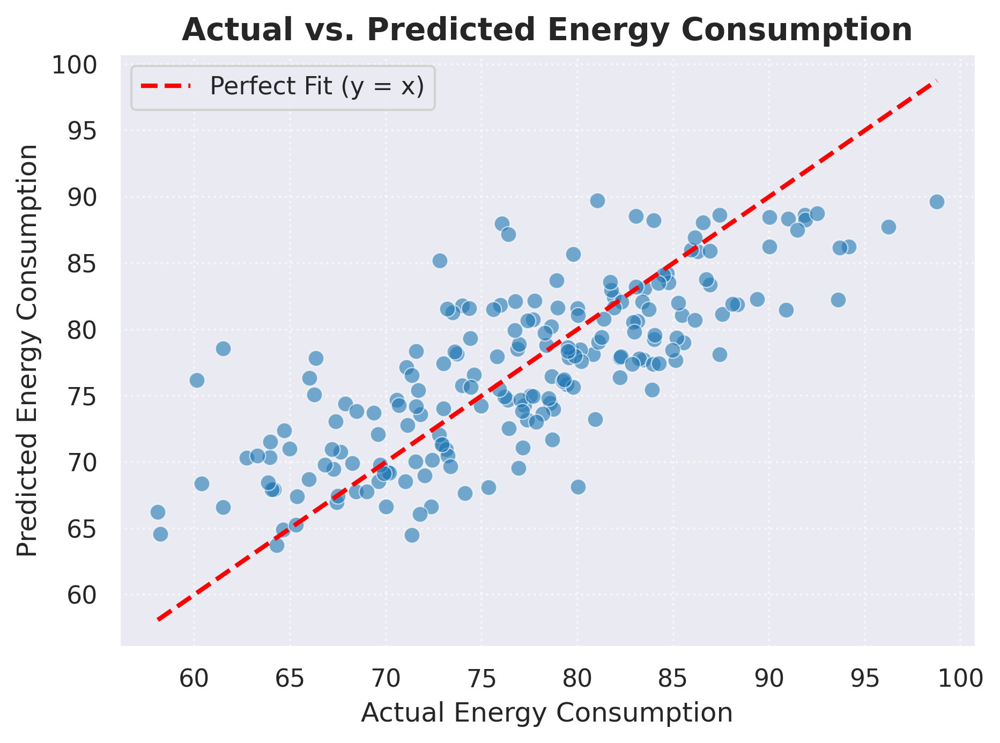

# Energy Consumption Prediction

## Overview

A machine learning regression project focused on predicting energy consumption using environmental conditions, building usage patterns, and other relevant features.

The project follows an end-to-end machine learning workflow, including exploratory data analysis, feature engineering, preprocessing, feature selection, model comparison, and evaluation.

## Project Structure

```text
energy-consumption-prediction/
│
├── README.md
├── energy-consumption-prediction.ipynb
├── .gitignore
├─── assets
		├── hvac_and_lighting_bar.png
		├── correlation_bar.png
		├── correlation_heatmap.png
		├── model_performance.png
		├── actual_vs_predicted.png

'
```

## Technologies & Dependencies

### Programming Language
- Python

### Libraries
- Pandas — data manipulation and analysis
- NumPy — numerical operations
- Matplotlib — data visualization
- Seaborn — statistical visualization
- Scikit-learn — preprocessing, feature selection, model training, and evaluation
- Jupyter Notebook — development environment

## Dataset

The dataset contains information about energy consumption along with environmental conditions and building usage patterns.

### Column Description

| Column | Description | Type |
|---|---|---|
| `Timestamp` | Date and time associated with each observation | Datetime |
| `DayOfWeek` | Day of the week on which the observation was recorded | Categorical |
| `Holiday` | Indicates whether the observation occurred on a holiday | Categorical |
| `HVACUsage` | Indicates the usage state of the HVAC system | Categorical |
| `LightingUsage` | Indicates the usage state of the lighting system | Categorical |
| `Temperature` | Recorded temperature | Numerical |
| `Humidity` | Recorded humidity level | Numerical |
| `Occupancy` | Number/level of occupants associated with the observation | Numerical |
| `RenewableEnergy` | Renewable energy contribution recorded for the observation | Numerical |
| `EnergyConsumption` | Energy consumption being predicted | Numerical / Target |
| `SquareFootage` | The total floor area of the building or space, measured in square feet. |


## Objectives

- Understand the factors associated with energy consumption.
- Explore relationships between the available features and the target variable.
- Engineer additional features from the existing data.
- Build a preprocessing pipeline for numerical and categorical features.
- Apply statistical and recursive feature selection techniques.
- Compare Linear Regression and Random Forest Regression.
- Select and evaluate the best-performing approach.

## Exploratory Data Analysis

The exploratory analysis examines:

- Data quality and missing values
- Duplicate observations
- Distribution of energy consumption
- Relationships between numerical variables
- Correlations with the target variable
- HVAC and lighting usage
- Energy consumption across different days and months

### Key EDA Findings

- HVAC usage showed a strong relationship with energy consumption.
- Temperature and occupancy were also important variables.
- HVAC and lighting usage showed noticeable effects on energy consumption.
- The observations cover January and February.

### Visual Insights
`Energy Consumption In Comparision with **HVACUsage** and **LightingUsage**`
<br>

`Feature Correlation Bar Chart`
<br>

`Correlation HeatMap`
<br>

`Model Performance Comparision Chart`
<br>

`Actual Vs Predicted Scatter Plot`
<br>
## Feature Engineering

Three additional features were created:

### Month

Extracted the month from `Timestamp` to capture potential monthly patterns.

### IsWeekend

Created a binary feature identifying Saturday and Sunday observations.

### HLUsage

Created a binary feature indicating whether both HVAC and lighting systems are being used simultaneously.

The original `Timestamp` column was removed before model training.

## Data Preprocessing

The following preprocessing techniques were used:

- Ordinal encoding for ordinal/binary categorical features
- One-hot encoding for nominal categorical features
- Min-Max scaling for numerical features
- `ColumnTransformer` to combine preprocessing steps
- `Pipeline` to keep preprocessing and modeling together

## Feature Selection

Two feature selection approaches were investigated:

### F-Test

`SelectKBest` with `f_regression` was used to identify features with a strong statistical relationship with the target.

### RFECV

Recursive Feature Elimination with Cross-Validation was used to identify relevant features for the regression models.

## Model Comparison

The following approaches were compared:

| Model | Feature Selection | R² | RMSE |
|---|---|---:|---:|
| Linear Regression | None | 0.592 | 5.167 |
| Random Forest Regression | None | 0.548 | 5.443 |
| Linear Regression | F-Test | **0.599** | **5.123** |
| Random Forest Regression | F-Test | 0.534 | 5.525 |
| Linear Regression | RFECV | 0.598 | 5.133 |
| Random Forest Regression | RFECV | 0.537 | 5.506 |

## Final Model

The best-performing approach was:

**Linear Regression + F-Test Feature Selection**

The final pipeline performs:

```text
Input Data
    ↓
Preprocessing
    ↓
F-Test Feature Selection
    ↓
Linear Regression
    ↓
Energy Consumption Prediction
```

### Performance

- **R²:** 0.599
- **RMSE:** 5.123

An R² of approximately 0.599 means the model explains about 59.9% of the variance in energy consumption on the test set.

## Key Findings

- HVAC usage is an important predictor of energy consumption.
- Temperature and occupancy are also influential features.
- Feature engineering provided additional information for the models.
- Linear Regression outperformed Random Forest Regression on this dataset.
- F-Test feature selection produced the best-performing tested combination.

## How to Run

### 1. Clone the repository

```bash
git clone https://github.com/jigarkhadka/energy-consumption
cd energy-consumption-prediction
```

### 2. Install dependencies

```bash
pip install pandas numpy matplotlib seaborn scikit-learn jupyter
```

### 3. Launch Jupyter Notebook

```bash
jupyter notebook
```

Open `energy-consumption-prediction.ipynb` and run the notebook from beginning to end.

## Conclusion

This project demonstrates an end-to-end machine learning regression workflow, from exploratory data analysis and feature engineering to preprocessing, feature selection, model comparison, and final evaluation.
